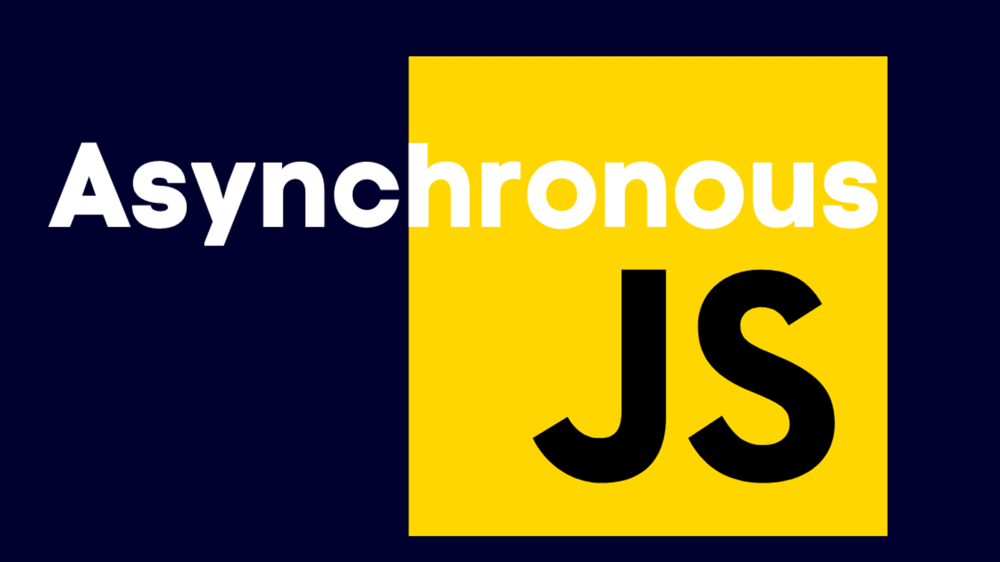

## This repo contains usefull information about asynchronous javascript with practicle coding challenges and how it works behind the scene.
#### this code is taken from [Jonas Schmedtmann's](https://github.com/jonasschmedtmann/complete-javascript-course) repo who is well known as a developer, designer and great instructor also😊. 
_________________________________________________________________________________________________________________________________________________________________________________
# Asynchronous❓

>Usually,In **synchronous** way tasks are performed one at a time and only when one is completed, the following is unblocked, so you need to wait for a task to finish to move to the next one.
>On the other hand, Asynchronous programming is a means of parallel way in which a one task runs separately from the main application thread.